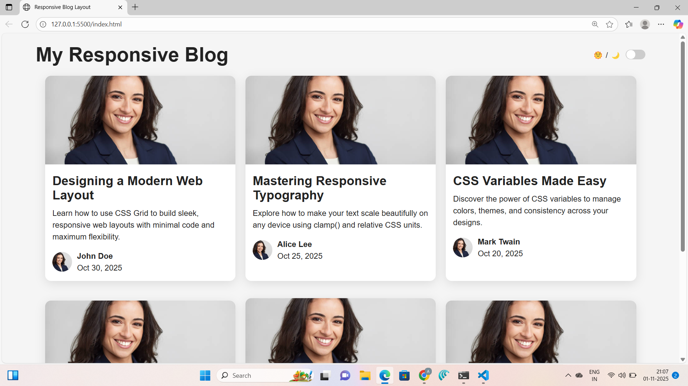

# 📰 Responsive Blog Layout 

A modern and elegant **responsive blog layout** built using **only HTML and CSS**, featuring a clean grid design, responsive typography, and a **Dark/Light mode** toggle — no JavaScript needed!

---

## 🌟 Overview

This project showcases how to create a **responsive blog homepage** using **CSS Grid** and **Flexbox**.  
Each post is presented as a card with:
- A featured image  
- Title and description  
- Author profile section (image, name, and date)

The layout automatically adjusts to different screen sizes — from desktop (3 cards per row) to tablet (2 per row) to mobile (1 per row).

A bonus **Dark/Light mode** is implemented using **pure CSS variables**, making it a great UI/UX enhancement and portfolio highlight.

---

## ✨ Features

✅ 100% HTML & CSS (no JavaScript)  
✅ Responsive design with CSS Grid  
✅ Smooth typography using `clamp()`  
✅ Dark / Light theme with CSS variables  
✅ Flexbox-based author info section  
✅ Clean, minimal card design  
✅ Works across all devices  

---
## 🧩 Folder Structure

responsive-blog/
├── index.html
├── style.css
└── screenshots/
├── light-mode.png
└── dark-mode.png


---

## 🖼️ Screenshots

| 💡 Light Mode | 🌙 Dark Mode |
|----------------|---------------|
|  |  |

---

## 🎨 Design Highlights

- **CSS Grid Layout:** Automatically adapts columns (`auto-fit`, `minmax`)  
- **Responsive Typography:** Scales text using `clamp()`  
- **Card Design:** Rounded corners, subtle shadows, hover lift effect  
- **Dark Mode:** CSS variable theme switch (no JS!)  
- **Author Section:** Flexbox for clean alignment  

---

## 🧠 What You’ll Learn

| Concept | Description |
|----------|--------------|
| **CSS Grid** | Create adaptive multi-column layouts easily |
| **Flexbox** | Align content (like author info) within cards |
| **CSS Variables** | Implement theming (light/dark mode) |
| **Responsive Units** | Use `clamp()`, `rem`, `em` for text scaling |
| **Box Shadows & Transitions** | Add polish and depth to UI elements |

---

## ⚙️ How to Run Locally

1. Clone this repository:
   ```bash
   git clone https://github.com/yourusername/responsive-blog-layout.git

## 🧩 Folder Structure
Open the folder:

cd responsive-blog-layout


Open index.html in your browser and enjoy the layout! ✨

🌐 Live Demo

🔗 http://127.0.0.1:5500/index.html


🛠️ Tech Stack

HTML5

CSS3 (Grid, Flexbox, Variables, Transitions)

📚 Learning Outcome

By completing this project, you’ll strengthen:

Your CSS Grid layout skills

Your understanding of responsive typography

How to create dark/light themes with only CSS

How to design elegant, minimal UI layouts

👩‍💻 Author
Ankithakanneboina
🌐 GitHub

💌 Open for collaboration and front-end opportunities

⭐ Acknowledgements

Inspired by modern design trends and built for improving front-end layout mastery.

If you liked this project, please give it a ⭐ on GitHub — it really helps!
